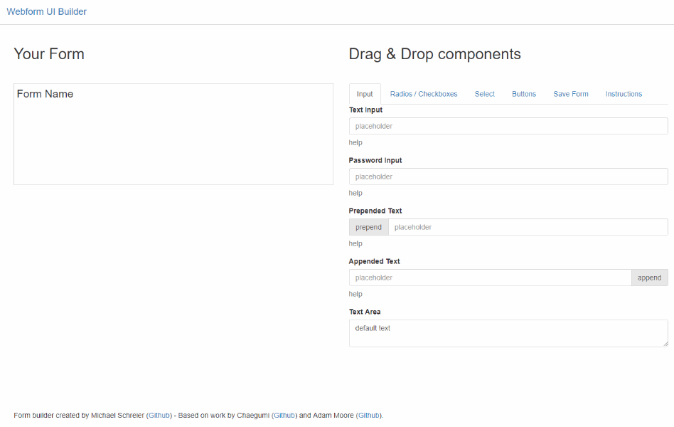
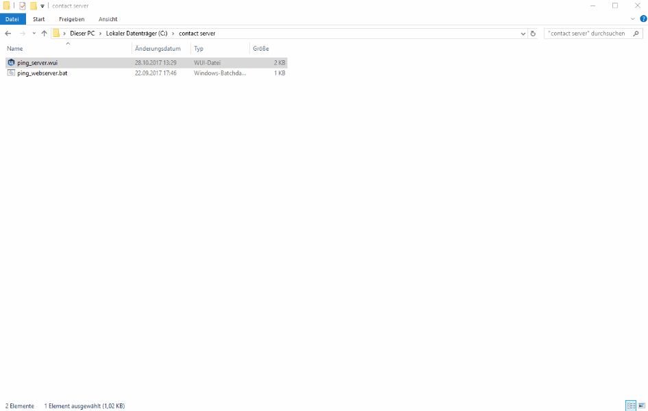

Download Windows binary [here](https://github.com/MichaelSchreier/WebformUI/releases/download/0.9.0/WebformUI.zip).

# Webform UI
Webform UI is a simple _drag and drop_ interface editor and script launcher in your browser. Interfaces built with webform UI can be added to any program or script that takes command line arguments. While webform UI is displayed in the browser all code runs on entirely on your on machine and does not require an internet connection.
In particular, webform UI can be used to distribute e.g. SAS or Python scripts, SQL queries and so on to end users not familiar with the script language themselves.

### Simple example
Assume you want to give users the ability to check the response times of certain webservers.
To this end we create a batch file
```Batchfile
ping %1
pause
```
and name it _ping_webserver.bat_. This script can be executed via the command line as e.g. `ping_webserver.bat www.github.com`.
To make this more accessible we can now open webform UI and create an interface with a _select_ field to choose the webservers in question, add the .bat file as target and save the interface.

Executing this interface file now gives the user an easy way to query the response times


### Deployment
Copy the webform UI executable to the users' machines and register the webform UI file extension (*.wui) with the executable.
__Note:__ The generated *.wui files need to be put in the same folder as the script which they are supposed to launch. Use shortcuts to make them accessible from any other location.

### Things to improve
+ Webform UI can only be used to _launch_ a script, but is currently not able to communicate with the script in any other way (e.g. to show results)
+ Due to security limitations in how html handles file uploads any files select via the file-picker interface element are copied to an intermedate folder by webform UI. Also, this folder must be cleaned by hand occasionally (or via the webform UI interface).
+ Interface files can not be modified in the browser after creation at this time - however, the files can be read and modified by the text editor of your choice.

### Usage with SAS
An example of how to parse the arguments in your script can be found [here](http://www.sascommunity.org/wiki/Parse_sysparm).


---
### Source dependencies
Webform UI is built on Python 3 as well as the following libraries:
+ [Beautiful Soup](https://www.crummy.com/software/BeautifulSoup) for building and parsing the interface files
+ [Flask](http://flask.pocoo.org) for the server component that is accessed through the web browser
+ [Font Awesome](http://fontawesome.io) for some of the symbols used in the web interface
+ [Bootstrap3 form builder](https://github.com/chaegumi/bootstrap3-form-builder) [JavaScript] for the actual interface builder (modified from source and distributed alongside webform UI)
